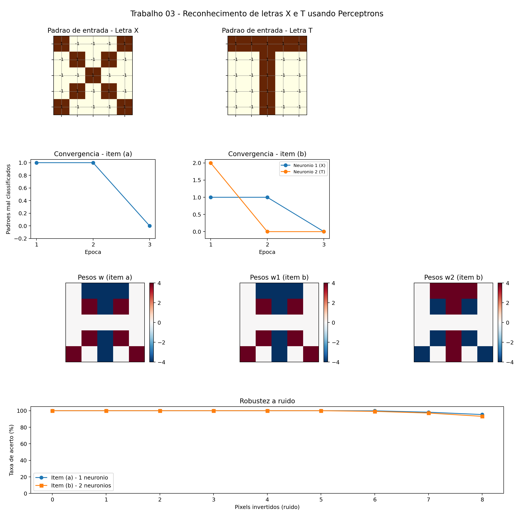

# Reconhecimento de letras X e T com Perceptrons


Implementação em Python do **Perceptron de Rosenblatt** para reconhecer duas letras
(**X** e **T**) representadas como imagens binárias $5\times5$ em codificação bipolar.

> Trabalho 03 da disciplina **EL056 – Redes Neurais Artificiais**
> PPGEELT / Universidade Federal de Uberlândia (UFU)

---

## Sobre o problema

Cada letra é uma grade $5\times5$ (25 pixels), onde pixel aceso vale $+1$ e pixel apagado
vale $-1$. Cada grade é achatada, linha a linha, em um vetor de entrada
$\mathbf{x} \in \{-1,+1\}^{25}$:

```
        Letra X                    Letra T
    ■  ·  ·  ·  ■             ■  ■  ■  ■  ■
    ·  ■  ·  ■  ·             ·  ·  ■  ·  ·
    ·  ·  ■  ·  ·             ·  ·  ■  ·  ·
    ·  ■  ·  ■  ·             ·  ·  ■  ·  ·
    ■  ·  ·  ·  ■             ·  ·  ■  ·  ·
```

Dois modelos são treinados e comparados:

| Item | Arquitetura | Saída desejada para X | Saída desejada para T |
|------|-------------|----------------------|----------------------|
| **(a)** | 1 neurônio | $y = +1$ | $y = -1$ |
| **(b)** | 2 neurônios (um "especialista" por letra) | $(y_1,y_2) = (+1,-1)$ | $(y_1,y_2) = (-1,+1)$ |

---

## Fundamentação

O neurônio calcula uma combinação linear das entradas e aplica um degrau bipolar:

$$\text{net} = \sum_{i=1}^{25} w_i x_i + b, \qquad
f(\text{net}) = \begin{cases} +1, & \text{net} \ge 0 \\ -1, & \text{net} < 0 \end{cases}$$

Os pesos são ajustados pela **regra de aprendizado de Rosenblatt**, padrão a padrão:

$$\mathbf{w} \leftarrow \mathbf{w} + \eta\,(t-y)\,\mathbf{x}, \qquad
b \leftarrow b + \eta\,(t-y)$$

Neste projeto: pesos e bias inicializados em **zero**, taxa de aprendizado $\eta = 1$,
e treinamento até erro zero em uma época completa.

---

## Como executar

```bash
# clonar e entrar no diretório
git clone <url-do-repo>
cd <nome-do-repo>

# ambiente virtual (recomendado)
python -m venv .venv
source .venv/bin/activate        # Windows: .venv\Scripts\activate

# dependências
pip install -r requirements.txt

# rodar
python perceptron_letras.py
```

O script imprime todos os resultados no terminal e grava, na pasta `saida/`:

- **`resultados.png`** – painel único com todos os gráficos (regerado a cada execução)
- **`resultados.txt`** – log completo com pesos, bias, épocas e taxas de acerto

Para a versão explicada passo a passo:

```bash
jupyter notebook trabalho03_perceptron.ipynb
```

---

## Estrutura do repositório

```
.
├── perceptron_letras.py         # implementação principal (itens a e b + teste de ruído)
├── trabalho03_perceptron.ipynb  # notebook didático com teoria + código + gráficos
├── requirements.txt             # dependências (numpy, matplotlib, jupyter)
├── relatorio.tex                # relatório LaTeX (corpo + código em anexo)
├── abnt_capa.tex                # capa e folha de rosto ABNT (PPGEELT/UFU)
├── relatorio.pdf                # relatório compilado
└── saida/
    ├── resultados.png           # painel consolidado de resultados
    └── resultados.txt           # log da execução
```

Classes principais em `perceptron_letras.py`:

- **`Perceptron`** – um neurônio com ativação bipolar e regra de Rosenblatt (`fit` / `predict`)
- **`CamadaPerceptrons`** – camada de $K$ perceptrons independentes (usada no item b)

---

## Resultados



### Classificação

Ambos os modelos atingem **100% de acerto** no conjunto de treino:

| Padrão | $y$ (item a) | alvo | $(y_1,y_2)$ (item b) | alvo |
|--------|-------------|------|---------------------|------|
| X | $+1$ | $+1$ | $(+1,-1)$ | $(+1,-1)$ |
| T | $-1$ | $-1$ | $(-1,+1)$ | $(-1,+1)$ |

### Convergência

- Item (a): **3 épocas** (erros por época: `[1, 1, 0]`)
- Item (b): neurônio 1 em **3 épocas**, neurônio 2 em **2 épocas**

### O que os pesos aprenderam

Dos 25 pixels, apenas os **12 que diferenciam X de T** recebem peso não nulo ($\pm4$).
Os outros 13 — incluindo toda a linha central, que vale $[-1,-1,+1,-1,-1]$ nas duas
letras — permanecem com peso **zero**: são irrelevantes para a decisão, e por isso o
perceptron simplesmente os ignora.

Duas propriedades verificadas numericamente:

- $\mathbf{w}_1 = \mathbf{w}_{(a)}$ — o neurônio 1 do item (b) tem o mesmo alvo do item (a), logo aprende os mesmos pesos
- $\mathbf{w}_2 = -\mathbf{w}_1$ — o alvo do neurônio 2 é exatamente o oposto

### Robustez a ruído

Cada letra foi corrompida invertendo de 1 a 8 pixels aleatórios (300 ensaios por nível):

| Pixels invertidos | 0–5 | 6 | 7 | 8 |
|---|---|---|---|---|
| Item (a) | 100% | 99,8% | 98,2% | 95,3% |
| Item (b) | 100% | 99,2% | 97,2% | 93,2% |

O limite tem explicação analítica: com 12 pesos de módulo 4, os padrões originais dão
$\text{net} = \pm48$, e cada pixel **discriminante** invertido altera $\text{net}$ em 8
unidades. São necessários, portanto, ao menos 6 pixels discriminantes invertidos para
cruzar a fronteira de decisão — e inversões nos outros 13 pixels não afetam nada.

---

## Relatório

O relatório completo (`relatorio.pdf`) traz a fundamentação teórica, a metodologia, a
discussão dos resultados e o código-fonte em anexo, com capa e folha de rosto no padrão
ABNT NBR 14724. Para recompilar:

```bash
pdflatex relatorio.tex && pdflatex relatorio.tex
```

---

## Autor

**Lucas Martins** — PPGEELT/UFU lucas.martins@ufu.br
Disciplina EL056 – Redes Neurais Artificiais — Prof. Dr. Keiji Yamanaka
